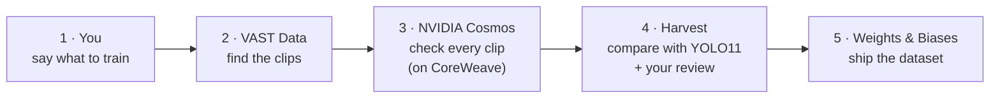

# How Harvest works

**In one line:** tell Harvest what you want your vision model to learn. It finds the clips in your video
archive, NVIDIA Cosmos checks every one, Harvest shows where your deployed model (YOLO11) gets them wrong,
and you get a clean, versioned training dataset in Weights & Biases.

## The picture




## Which organiser tool does what

| Tool | What it does in Harvest | Code |
|---|---|---|
| **VAST Data** (DataEngine + VastDB + VSS API) | Holds the archive (2,352 segments) with everything computed at ingest. Harvest **searches** it (`/api/v1/search`, filtered by camera), **streams** clips (`/api/v1/videos/stream`) and reads the **YOLO11 detections** already stored for each clip (`/api/v1/videos/detections`). | `harvest/vss.py` |
| **NVIDIA Cosmos3-Reason** | The judge. For every clip: does it really show the use case (keep or reject, with a reason)? Which objects, how many, what conditions, what events? Then, from the comparison, it **writes the suggested model fixes**. Strict JSON output (guided decoding). | `harvest/audit.py: inventory()`, `harvest/flow.py: suggest()` |
| **YOLO11** (run by the VAST pipeline at ingest) | The deployed model being graded. Its stored answers are compared with Cosmos's. | `harvest/audit.py: compare()` |
| **CoreWeave** | The GPUs Cosmos3-Reason (and the ingest models) run on. | event stack |
| **W&B Inference** | Turns a request written in your own words into VAST searches and cameras. | `harvest/planner.py` |
| **W&B Experiments + Artifacts** | Each dataset becomes a run: a table of every clip (video, kept or removed, Cosmos vs YOLO11), the detection-rate chart, Cosmos's suggestions, Cosmos's precision after your review, and the dataset itself as a **versioned artifact** a training job pulls in one line. | `harvest/flow.py: export()` |

## The flow, step by step

| # | Step | What happens |
|---|---|---|
| 1 | **Say what to train** | Pick a use case (forklift, close call, break-in, e-scooter, traffic) or describe your own, with cameras, must-show objects (including your own, like "can" or "tree") and lighting. |
| 2 | **Find clips** | Harvest searches VAST across the chosen cameras. |
| 3 | **Cosmos check** | Cosmos watches each clip and keeps only the ones that really match. Too few? Harvest searches deeper, round after round (up to 4), never re-checking a clip. |
| 4 | **Compare with YOLO11** | For each object Cosmos saw: did YOLO11 report it (**missed**)? For each label YOLO11 reported: did Cosmos see it (**made up**)? |
| 5 | **Review** | You remove any clip Cosmos got wrong; Harvest finds replacements. |
| 6 | **Suggestions** | Cosmos writes what to change in the model, from the numbers (e.g. "add a forklift class; add hard negatives for 'truck'"). |
| 7 | **Export** | The fixed dataset (clips, frames, `annotations.jsonl` with Cosmos's labels) goes to W&B as a versioned artifact. |
| 8 | **Report** | Before vs after: raw search + YOLO11 labels vs the Harvest dataset, with the camera-audit baseline. |

## Why it's cheap

YOLO11 already ran when the video was indexed, so Harvest reads its answers from VAST for free. The only new
GPU work is one Cosmos call per clip (about 5 seconds), and only on clips the search already found.

## Evidence at scale: the camera audit (48 clips, 4 cameras)

The same check without a use case: sample every camera and grade YOLO11 on everything Cosmos sees.
**Forklift detected in 0 of 22 clips** (reported as truck, car, suitcase); "airplane" reported on the
I-24 highway in 10 of 12 clips; 6 object types never detected. This is where you find *what* to train.

```bash
python3 -m harvest.audit --cameras sdg_warehouse_cam-2,i24_cam-1,pie_cam-3,smartspace_cam-1 --per-camera 12 --wandb
```

## Code map

| File | Does |
|---|---|
| `app.py` | The Streamlit app: launch page, Build dataset, Audit report |
| `harvest/landing/` + `harvest/ui_landing.py` | The launch page (three.js), hands your choice to the app |
| `harvest/flow.py` | Use case → search → Cosmos check → compare → suggestions → export |
| `harvest/vss.py` | VAST: login, search, stream a clip, read its YOLO11 detections |
| `harvest/audit.py` | Cosmos prompt and parsing, the Cosmos-vs-YOLO11 comparison, the camera audit |
| `harvest/planner.py` | W&B Inference search planner |
| `harvest/ui_flow.py`, `ui_report.py`, `ui_audit.py` | The Build dataset and Audit report pages |

Run it:
```bash
python3 -m streamlit run app.py --server.port 8501
```

Metrics and limits: [EVALUATION.md](EVALUATION.md). Older, more detailed notes: [docs/architecture-detailed.md](docs/architecture-detailed.md).
