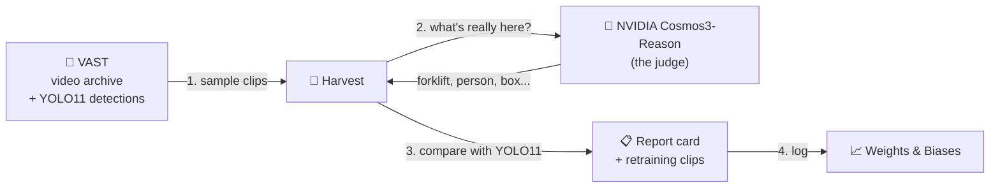

# How Harvest works

**In one line:** Harvest checks the vision model that is already running on your cameras, finds what it
can't see, and gives you those clips to retrain it.

## The picture



## The four steps

| # | Step | What happens | Sponsor tool |
|---|---|---|---|
| 1 | **Sample** | Pull ~12 clips per camera from the archive. Each clip already has the YOLO11 detections that were saved when the video was indexed. | **VAST Data** |
| 2 | **Judge** | Cosmos3-Reason watches each clip and lists what is really there: objects, how many, and the conditions (light, crowding, distance). | **NVIDIA Cosmos** on **CoreWeave** GPUs |
| 3 | **Compare** | For each object Cosmos saw: did YOLO report it? For each label YOLO reported: did Cosmos see it? | Harvest |
| 4 | **Report + fix** | Detection rate per object and camera, made-up labels, and a zip of the failing clips to retrain on. Every audit is logged. | **Weights & Biases** |

## Example (from our real run: 48 clips, 4 cameras)

Cosmos sees **a person and a forklift**. YOLO11 reports **person, truck, suitcase**.
- person → found ✅
- forklift → **missed** ❌ (YOLO's training set, COCO, has no forklift class)
- truck, suitcase → **made up** ⚠️ (nothing in the clip explains them)

Repeat over 48 clips → **forklift detected in 0 of 22 clips**, "airplane" reported on the highway in 10 of 12 clips.

## Why it's cheap

YOLO11 already ran when the video was indexed, so Harvest just reads its answers from VAST. The only new
GPU work is one Cosmos call per clip (about 5 seconds).

## Code map

| File | Does |
|---|---|
| `harvest/vss.py` | Talks to VAST: login, search, download a clip, read its YOLO detections |
| `harvest/audit.py` | The audit: sample → ask Cosmos → compare → report → W&B → retraining zip |
| `harvest/ui_audit.py` | The Audit page you see in the app |
| `app.py` | The Streamlit app (Audit page + the older clip-mining tools) |

Run it:
```bash
python3 -m harvest.audit --cameras sdg_warehouse_cam-2,i24_cam-1,pie_cam-3,smartspace_cam-1 --per-camera 12 --wandb
python3 -m streamlit run app.py --server.port 8501
```

Metrics and limits: [EVALUATION.md](EVALUATION.md). Full technical detail (API endpoints, the clip-mining
mode): [docs/architecture-detailed.md](docs/architecture-detailed.md).
