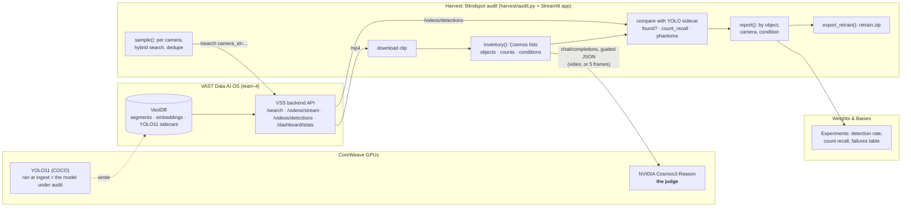
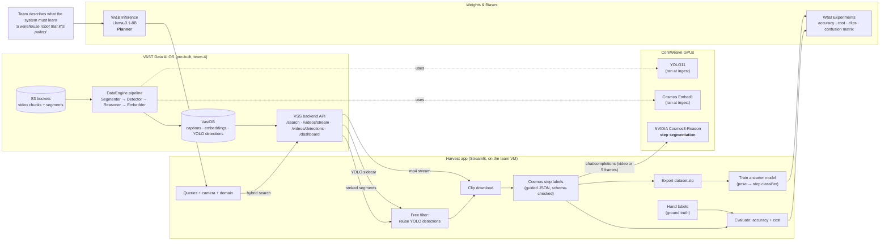

# Harvest: architecture

**Harvest finds where a deployed vision model fails, across the whole archive, and hands you the clips to fix it.**

Every camera in the VAST pipeline already runs YOLO11 at ingest, and those detections sit in VastDB.
Nobody grades them. Harvest's Blindspot audit uses NVIDIA Cosmos3-Reason as a judge: for each sampled clip, Cosmos lists
what is actually there (objects, counts, conditions). Harvest compares that with what YOLO stored and reports:

- **Missed entirely**: the object is there and YOLO never names it (forklift: 0%, because COCO has no forklift class).
- **Undercounted**: YOLO finds the object, but only part of them. `count_recall` = YOLO objects per frame ÷ Cosmos count.
- **Phantoms**: YOLO reports a class that Cosmos does not see (for example a "cow" on the I-24 highway).
- **Where it fails**: everything above broken down by camera and by condition (lighting, crowding, occlusion, distance).
- **The fix**: the failing clips go out as a retraining set (`retrain.zip`).

> How this differs from the event's Video Search & Summary app: VSS helps a *person* find and describe a
> moment. Harvest grades the *perception model* that is already running on every camera, and turns its
> failures into training data.



## Data flow, one clip

| Step | Code | Input | Output |
|---|---|---|---|
| 1. Sample | `audit.sample()` | camera id, queries | archive segment ids (`source`) |
| 2. Download | `vss.download()` | `source` | `clips/<id>.mp4` |
| 3. Judge | `audit.inventory()` → Cosmos3-Reason | the clip | `{"objects":[{name,count,visibility}], "conditions":{lighting,crowding,occlusion,distance}}` |
| 4. Read YOLO | `vss.detections()`, `vss.class_counts()`, `vss.per_frame()` | `source` | classes found; objects per frame = `object_counts / frame_count` |
| 5. Compare | `audit.run()` | 3 + 4 | per object: `yolo_found`, `yolo_avg_count`, `count_recall`; per clip: `phantoms` |
| 6. Aggregate | `audit.report()` | all clips | `report.json`: headline, objects, phantoms, by_camera, by_condition, retrain list |
| 7. Log / export | `audit.log_wandb()`, `audit.export_retrain()` | run dir | W&B run, `retrain.zip` |

Cost note: YOLO already ran at ingest, so the audit reads it for free. The only new GPU work is one
Cosmos call per sampled clip (about 4 s each).

---

# Second mode: Mine clips (labelled clips from a request)

**Harvest turns an existing video archive into training data for AI systems** (warehouse robots,
self-driving stacks, safety and store analytics), and proves the data is good.

> The event's Video Search & Summary app tells a *person* what happened in a clip (a paragraph).
> Harvest turns those moments into *machine-learnable* labels — timed action steps — then measures
> their accuracy, prices the run, exports a dataset, and trains a starter model on it.

## The system at a glance



## Which technology does what

| Technology | Role in Harvest | Code |
|---|---|---|
| **W&B Inference** (serverless LLM, Llama-3.1-8B) | **Planner.** Turns a plain-English need into 2–3 visual search queries, the right camera, and the domain (label set). | `harvest/planner.py` |
| **VAST DataEngine + VastDB** | The archive is already segmented, captioned (Cosmos), embedded (Cosmos Embed) and YOLO-tagged at ingest. Harvest builds on that index instead of re-processing video. | (pre-built) |
| **VAST VSS API** | Login → `POST /api/v1/search` (hybrid caption + visual search) → `/videos/stream` (clip) → `/videos/detections` (YOLO sidecar) → `/dashboard/stats` (archive size). | `harvest/vss.py` |
| **YOLO11** (CoreWeave) | **Free filter.** Its detections were computed at ingest; Harvest reuses them to drop hits with no actor (no person / vehicle) before spending Cosmos. | `harvest/pipeline.py` |
| **NVIDIA Cosmos3-Reason** (CoreWeave) | **The labeller.** Watches each kept clip and returns the action label + timed steps as strict JSON (guided decoding; lenient repair if needed). | `harvest/segment.py` |
| **Weights & Biases** (experiments) | Logs label accuracy vs hand labels, boundary error, GPU cost vs brute force, a clip table with video, the student model's accuracy and confusion matrix. | `harvest/evaluate.py`, `harvest/train.py` |
| **CoreWeave GPUs** | Serve Cosmos3-Reason, Cosmos Embed1 and YOLO11 for the whole stack. | (event stack) |

## What happens, step by step

1. **Plan** — *"a self-driving system that detects vehicles changing lanes"* → W&B Inference →
   `{"domain": "traffic", "camera_id": "i24_cam-1", "queries": ["vehicles changing lanes on highway", ...]}`.
   The team can edit the queries before running.
2. **Search** — each query goes to the VAST search API, scoped to the camera. VAST returns ranked
   5-second segments with their caption and similarity score. No video is re-processed.
3. **Filter (free)** — for each hit Harvest reads the YOLO11 detections already stored for that
   segment. Hits with no actor are dropped before any GPU time is spent.
4. **Fetch** — the kept segment is streamed from VAST S3 as an mp4.
5. **Label (Cosmos3-Reason)** — the clip is sent to Cosmos3-Reason with the domain's vocabulary:

   | Domain | Labels | Steps |
   |---|---|---|
   | warehouse | pick_up_object, carry_object, place_object, push_or_pull_cart, operate_forklift, … | approach, reach, grasp, lift, carry, place, push_or_pull, walk |
   | traffic | vehicle_turn, lane_change, vehicle_stop, vehicle_pass, pedestrian_crossing, near_miss | approach, slow_down, stop, accelerate, turn, lane_change, cross, pass |
   | people | person_walks_through, person_picks_up, person_hands_over, person_near_vehicle, fall_or_slip | enter, walk, stop, reach, pick_up, hand_over, carry, exit |

   Cosmos returns `{"label", "steps": [{"name", "start_s", "end_s", "conf"}], "objects", "notes"}`.
   Guided JSON keeps it inside the vocabulary; a forgiving parser maps near-misses
   (`push_or_pull_cart` → `push_or_pull`) and repairs small JSON errors, so no clip is lost.
6. **Ground truth** — a person hand-labels ~20 clips on the Label page *before* seeing Cosmos's answer.
7. **Evaluate** — label accuracy, step recall / precision (same step, IoU ≥ 0.5), boundary error in
   seconds; and cost: Cosmos on every segment of the archive (brute force) vs Harvest (search + reused
   YOLO + Cosmos on the hits only). Logged to W&B.
8. **Export** — `dataset.zip`: clips + `annotations.jsonl` + a README with the accuracy and cost.
9. **Train** — a small pose-based step classifier learns from the harvest and is scored on clips it
   never saw, against a "guess the most common step" baseline. Logged to W&B. This closes the loop:
   *archive → labelled data → working model in one afternoon.*

## Data contracts

**One clip record** (`out/<query>/clips.jsonl`):
```json
{"clip_id": "seg003", "domain": "warehouse", "source": "s3://.../segment.mp4",
 "camera_id": "sdg_warehouse_cam-2", "search_score": 0.32, "index_caption": "A forklift ...",
 "tracks": {"person": 150}, "label": "operate_forklift",
 "steps": [{"name": "approach", "start_s": 0.0, "end_s": 1.2, "conf": 0.8},
           {"name": "lift", "start_s": 1.2, "end_s": 3.4, "conf": 0.7}],
 "gpu_s": {"yolo": 0.0, "cosmos": 4.6}, "file": "clips/seg003.mp4"}
```

**Run funnel** (`stats.json`): archive segments searched → VAST hits → kept by the YOLO filter →
labelled by Cosmos, with Cosmos seconds and wall time.

## Why it's built this way

- **Reuse, don't recompute.** VAST already captioned, embedded and detected every segment at ingest.
  Harvest spends Cosmos only on the handful of segments search returns — that is where the cost
  saving comes from.
- **Structured output, not prose.** A model can't train on a paragraph. Timed steps in a fixed
  vocabulary can be scored, compared and learned from.
- **Measured, not assumed.** Every dataset ships with its own accuracy against hand labels.
- **Any vision system.** The domain only changes the vocabulary; the pipeline is the same.

## Files

```
app.py                 Streamlit UI: Harvest · Label · Evaluate · Train
harvest/planner.py     W&B Inference planner
harvest/vss.py         VAST VSS API client (login, search, stream, detections, dashboard)
harvest/pipeline.py    the run: search → filter → fetch → label → clips.jsonl + stats.json
harvest/segment.py     Cosmos3-Reason step segmentation (guided JSON + repair)
harvest/evaluate.py    accuracy + cost, W&B logging
harvest/export.py      dataset.zip
harvest/train.py       starter model on the harvest, W&B logging
harvest/config.py      domains, vocabularies, settings
```
