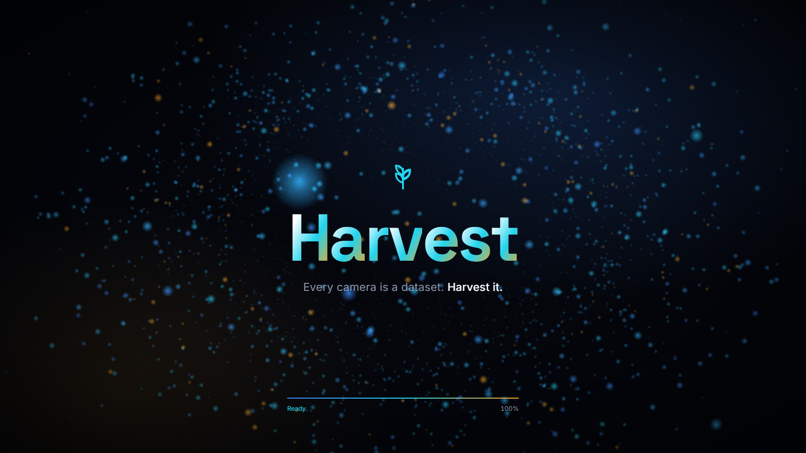
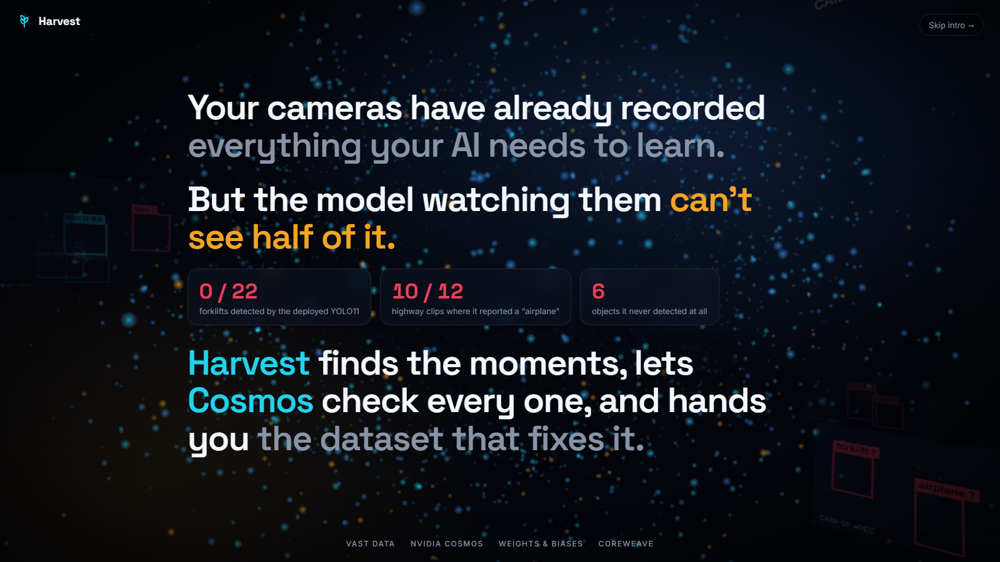
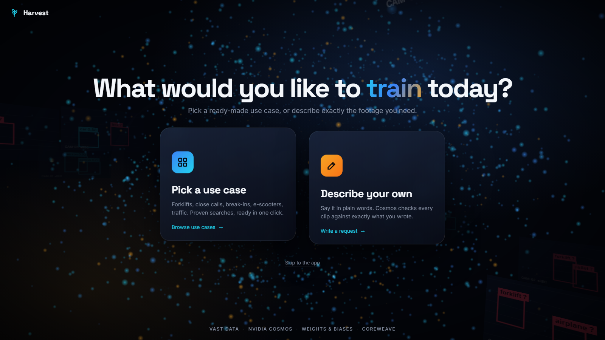
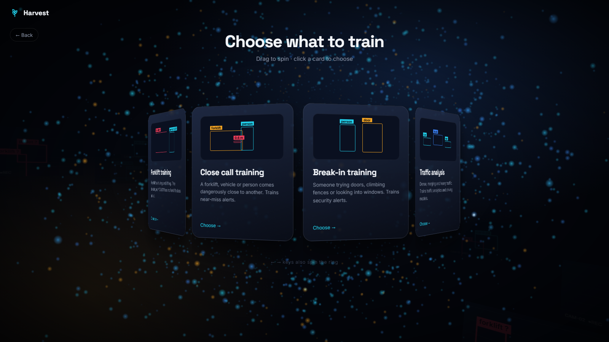
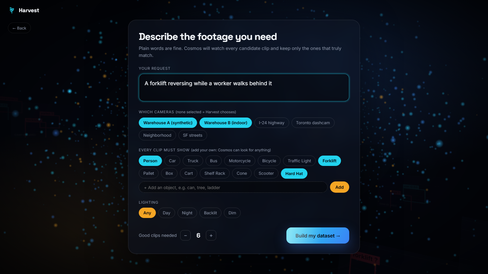
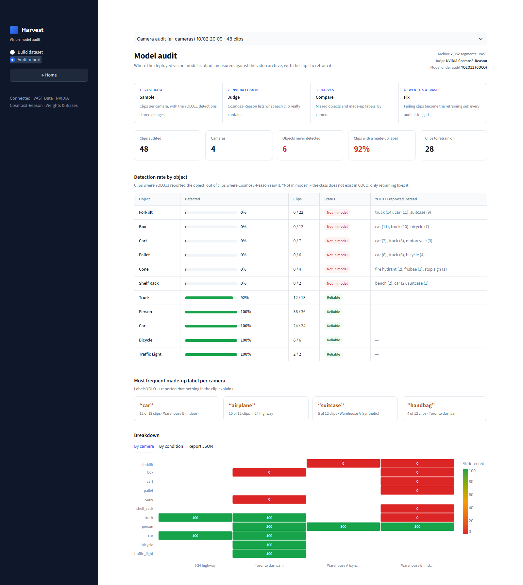

# Harvest

**Say what you want your vision model to learn. Harvest finds the clips in your video archive, NVIDIA Cosmos
checks every one, Harvest shows what your deployed model (YOLO11) missed or made up, and you get a clean,
versioned training dataset in Weights & Biases.**

**[▶ Watch the 3-minute demo](https://youtu.be/VZQjUoIeM70)**

[](https://youtu.be/VZQjUoIeM70)


## Screenshots

| | |
|---|---|
|  **Launch:** “Every camera is a dataset.” |  **The problem**, with real numbers from the audit |
|  **What would you like to train today?** |  **Pick a use case:** a 3D ring you drag |
|  **Describe your own:** cameras, must-show objects (add any, e.g. “hard hat”), lighting |  **Audit report:** the deployed YOLO11 graded by Cosmos on 48 clips |

## What it does

1. **Say what to train.** Pick a use case (forklift, close call, break-in, e-scooter, traffic) or describe
   your own: which cameras, which objects every clip must show (including any object you name, like
   “can” or “hard hat”), and the lighting.
2. **Find clips.** Harvest searches the VAST archive (2,352 indexed segments). Each clip already carries the
   YOLO11 detections from ingest.
3. **Cosmos check.** NVIDIA Cosmos3-Reason watches every clip and keeps only the ones that really match, with
   a reason. Too few? Harvest searches deeper, round after round, never re-checking a clip.
4. **Compare with YOLO11.** For every object Cosmos saw: did YOLO11 report it (**missed**)? For every label
   YOLO11 reported: did Cosmos see it (**made up**)? Objects YOLO11 has no class for are flagged
   **not in model**, with what it said instead.
5. **Review.** Remove any clip Cosmos got wrong; Harvest finds a replacement.
6. **Suggestions.** Cosmos writes what to change in the model, from the numbers.
7. **Export.** The fixed dataset (clips, frames, `annotations.jsonl`) goes to Weights & Biases as a
   versioned artifact, with a table of every clip (video, Cosmos vs YOLO11, your review) and Cosmos's
   precision after review.
8. **Report.** Before vs after: raw search + YOLO11's own labels vs the Harvest dataset, next to the camera
   audit's baseline.

## The finding that started it: a camera audit of the event footage (48 clips, 4 cameras)

| Object (Cosmos saw it in) | YOLO11 detected | What YOLO11 reported instead, in those clips |
|---|---|---|
| forklift (22 clips) | **0%** | truck (14), car (11), suitcase (9), boat (7) |
| box (12) | **0%** | car (11), truck (10), bicycle (7) |
| cart (7) | **0%** | car (7), truck (6) |
| pallet (6) | **0%** | car (6), truck (6) |
| cone (4, Toronto dashcam) | **0%** | fire hydrant (2) |
| person (36), car (24), bicycle (6) | 100% | |
| truck (13) | 92% | |

Labels nothing in the clip explains: **“car” in 12 of 12 indoor warehouse clips** and **“airplane” in 10 of
12 I-24 highway clips**. Cosmos time: 230 s for 48 clips (about 5 s each). The “instead” column counts labels
YOLO11 reported in the same clips; it is not a box-by-box match. The judge is Cosmos3-Reason, not hand labels.

## Organiser tools

| Tool | Role |
|---|---|
| **VAST Data** (DataEngine, VastDB, VSS API) | the indexed archive; search, clip streaming, and the YOLO11 detections stored at ingest |
| **NVIDIA Cosmos3-Reason** | the judge: keeps or rejects each clip, lists objects, conditions and events, writes the model fixes |
| **CoreWeave** | the GPUs Cosmos runs on |
| **W&B Inference** | turns a request in your own words into searches |
| **W&B Experiments + Artifacts** | every dataset as a run (table with video, chart, suggestions, precision) and a versioned artifact |
| **YOLO11** | the deployed model being graded (run by the VAST pipeline at ingest) |

**[Architecture →](ARCHITECTURE.md)** · **[Inputs, outputs and evaluation →](EVALUATION.md)**

## Run it (on the event VM)

```bash
git clone https://github.com/karanjit-nexovia/harvest && cd harvest
python3 -m pip install --user -r requirements.txt
WANDB_API_KEY=<your key> WANDB_TEAM=<your W&B team> WANDB_PROJECT=harvest \
  python3 -m streamlit run app.py --server.port 8501
```

The VAST and Cosmos credentials are read from the VM (`/config` or its environment); nothing is hard-coded.
Open http://localhost:8501 (add `?intro=0` to skip the launch page).

Command line:
```bash
python3 -m harvest.flow "Close call training" --target 6 --wandb     # build a dataset
python3 -m harvest.audit --cameras sdg_warehouse_cam-2,i24_cam-1,pie_cam-3,smartspace_cam-1 --per-camera 12 --wandb
```
