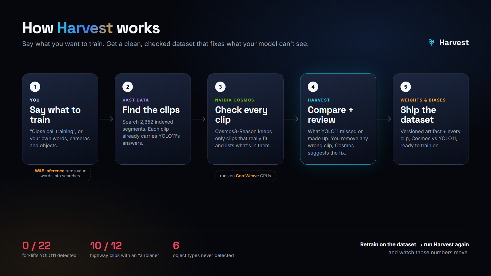

# Harvest



**Your vision model is already running on every camera. Nobody checks it.**
Harvest runs a **Blindspot audit**: it uses NVIDIA Cosmos3-Reason as a judge over the VAST-indexed video archive, grades the YOLO11
detections the pipeline stored at ingest, and finds where the model is blind — by object, by camera
and by condition (lighting, crowding, occlusion, distance). Then it hands you the failing clips as a
retraining set, and logs the whole audit to Weights & Biases.

## Results: audit of the event corpus (48 clips, 4 camera packs, 2,352 segments indexed)

| Object (Cosmos saw it in) | YOLO11 detected | What YOLO reported instead, in those clips |
|---|---|---|
| forklift (22 clips) | **0%** | truck (14), car (11), suitcase (9), boat (7) |
| box (12) | **0%** | car (11), truck (10), bicycle (7) |
| cart (7) | **0%** | car (7), truck (6) |
| pallet (6) | **0%** | car (6), truck (6) |
| cone (4, Toronto dashcam) | **0%** | fire hydrant (2) |
| person (36), car (24), bicycle (6) | 100% | |
| truck (13) | 92% | |

Phantoms (labels nothing in the clip explains): **"car" in 12 of 12 indoor warehouse clips**, and
**"airplane" in 10 of 12 I-24 highway clips**. Cosmos time: 230 s for 48 clips (about 5 s each).
W&B run: https://wandb.ai/vastdata/team-4/runs/0z157l5m

The "instead" column counts labels YOLO reported in the same clips. It shows how the model reads a
scene it has no class for; it is not a box-by-box match. The judge is Cosmos3-Reason, not hand labels.

| Sponsor tool | Role |
|---|---|
| **VAST Data** (DataEngine, VastDB, VSS API) | the indexed archive, search to sample each camera pack, stored YOLO detections, clip streaming |
| **NVIDIA Cosmos3-Reason** | the judge: a strict inventory of what is really in each clip (objects, counts, conditions) |
| **YOLO11** | the model under audit (its ingest-time detections) |
| **Weights & Biases** | the audit report: detection rates, phantoms, failure table with video; W&B Inference powers the Harvest planner |
| **CoreWeave GPUs** | serve Cosmos3-Reason, YOLO11, Cosmos Embed |

```bash
python3 -m harvest.audit --cameras sdg_warehouse_cam-2,i24_cam-1,pie_cam-3,smartspace_cam-1 --per-camera 12 --wandb
python3 -m streamlit run app.py      # Blindspot audit page: charts, failures, export the retraining set
```

**[Architecture →](ARCHITECTURE.md)** · **[Inputs, outputs and evaluation →](EVALUATION.md)**

---

## Second mode: Mine clips (labelled training clips from a plain-English request)


**Turn the video archive you already have into training data for AI systems** — warehouse
robots, self-driving stacks, safety and store analytics. Describe what your system must learn;
Harvest finds the moments (VAST search), labels every step with timestamps (NVIDIA Cosmos3-Reason),
proves the labels against hand labels and prices the run (Weights & Biases), exports the dataset,
and trains a starter model on it.

> VSS tells a person what happened. Harvest turns it into data a model can learn from — and proves
> the data is good.

**[Architecture: how it works and which technology does what →](ARCHITECTURE.md)** · **[Inputs, outputs and evaluation →](EVALUATION.md)**

```
query ─► search (VAST / CLIP / motion) ─► YOLO + pose filter (cheap, edge-able)
      ─► cut clips ─► Cosmos: reach / grasp / pull / … with timestamps (JSON)
      ─► eval vs hand labels + cost vs "Cosmos on everything" ─► export dataset.zip
      ─► train: a small pose model learns the steps from the harvest (scored on unseen clips)
```

## Run it (5 min)

```bash
git clone https://github.com/karanjit-nexovia/harvest && cd harvest
python -m venv .venv && source .venv/bin/activate      # Windows: .venv\Scripts\activate
pip install -r requirements.txt
cp .env.example .env        # put the event's keys in
# drop the sample videos in data/raw/
streamlit run app.py
```

No keys yet? `HARVEST_MOCK=1 streamlit run app.py` runs everything with fake Cosmos answers.

CLI:
```bash
python -m harvest.pipeline "person takes an item from a shelf" --k 50
python -m harvest.evaluate out/person_takes_an_item_from_a_shelf --wandb
python -m harvest.export   out/person_takes_an_item_from_a_shelf
python -m harvest.train    out/person_takes_an_item_from_a_shelf --wandb
```

## Wiring the event's stack (.env)

| Piece | Setting |
|---|---|
| Cosmos | `COSMOS_BASE_URL`, `COSMOS_API_KEY`, `COSMOS_MODEL` — any OpenAI-compatible endpoint. `COSMOS_INPUT=frames` (works with any vision model) or `video` (sends the mp4). |
| Semantic search | `SEARCH_BACKEND=vast` + `VAST_SEARCH_URL` (POST `{"query","k"}` → `[{"video","start","end","score"}]`). Adapt `harvest/search.py::_vast` to the event API. `clip` = local CLIP, `motion` = no model (always works). |
| YOLO | `YOLO_MODEL`, `YOLO_DEVICE` (`0` on a GPU box), `HAND_ACTIVITY` (filter strictness) |
| W&B | `wandb login`, then Evaluate page → "Log to Weights & Biases" |
| Cost | `GPU_DOLLARS_PER_HOUR` |

## Demo checklist
1. Precompute 2–3 queries before demos (the Harvest page lists past runs instantly).
2. Label 20 clips on the **Label** page *before* looking at Cosmos's steps.
3. **Evaluate** → W&B report: label accuracy, step recall/precision, boundary error, GPU saving ×.
4. **Train** page → "Train step model": the student model's step accuracy on unseen clips, with
   Cosmos (teacher) and student timelines side by side. That's "data → working model in an afternoon".
5. Record a backup screen video.

See **[EVALUATION.md](EVALUATION.md)** for inputs, outputs, metrics and how to reproduce the evaluation.

Test videos in `data/raw/` are Intel IoT DevKit samples (CC BY 4.0). Use the event's videos for the demo.
